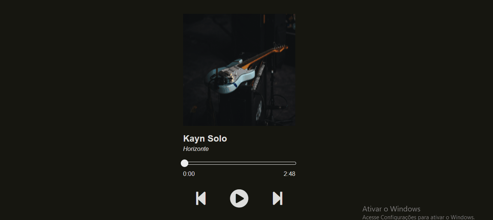

<h1 align="center">Player de musica</h1>

 
 
  
  

Este projeto é uma ideia minha e foi feito com o intuíto de colocar em prática as habilidades adquiridas no curso ProgramadorBr até o módulo HTML- INTERMEDIÁRIO

<a href='#Demonstração'>Demonstração</a>
<a href='#Autor'>Autor</a>

# Demonstração
<table>
<tr>
<td></td>
<td></td>
</tr>
</table>

# Autor

Produzido e elaborado por Luan Bortoleto, programador e estudante de Front-End '(HTML, CSS, JAVASCRIPT)'

# Projeto
<h2>

</h2>

### Tecnologias

As seguinter ferramentas foram usadas na construção do projeto:

<ul>
<li>HTML5</li>
<li>CSS3</li>
<li>JAVASCRIPT</li>
</ul>

