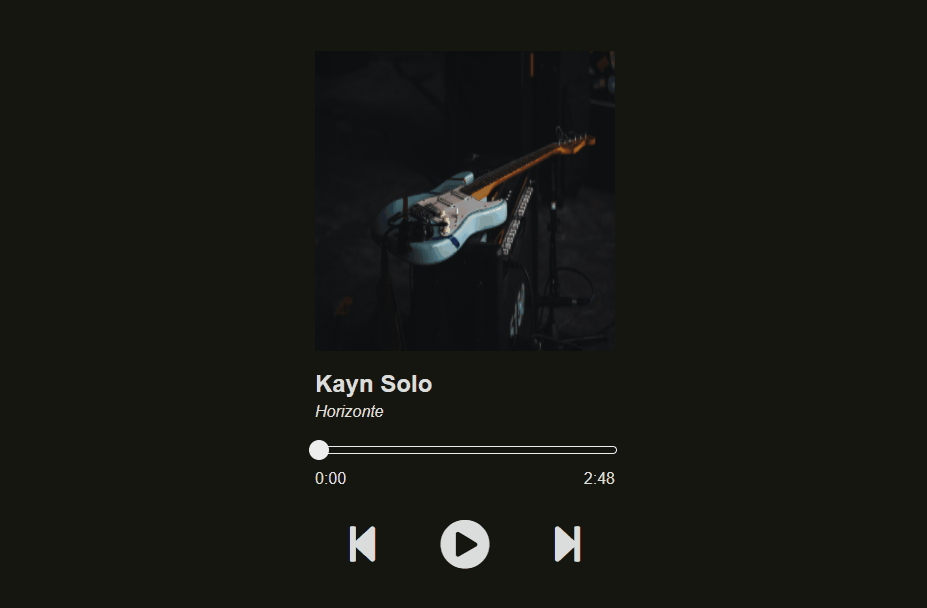

<h1 align="center">Player de musica</h1>

 
 
  
  

Este projeto é uma ideia minha e foi feito com o intuito de colocar em prática as habilidades adquiridas no curso ProgramadorBr até o módulo HTML- INTERMEDIÁRIO

  <a href="#demonstração">Demonstração</a>&nbsp;&nbsp;|&nbsp;&nbsp;
  <a href="#autor">Autor</a>&nbsp;&nbsp;|&nbsp;&nbsp;
  <a href="#tecnologias">Tecnologias</a>
 
  

### Tecnologias

As seguintes ferramentas foram usadas na construção do projeto:

<ul>
<li>HTML5</li>
<li>CSS3</li>
<li>JAVASCRIPT</li>
</ul>

# Demonstração

 <a  href='https://luan400.github.io/playermusica/'> Teste aqui</a>

# Autor

Produzido e elaborado por <a href='https://www.instagram.com/luanbortoleto/'>Luan Bortoleto</a>, programador Full Stack, atualmente estudando Front-End '(HTML, CSS, JAVASCRIPT)'

